#  Linear Integrated Circuits Laboratory  

## Experiment 2:Common Source Amplifier -CONFIGURSTIONS(TSMC 180nm)

**Name:** Suhas Koushik K S  
**USN:** 4NI24EC180  
**Branch:** Electronics and Communication Engineering  
**Lab Course:** Linear Integrated Circuits (BEC456B)  
**Tool Used:** LTspice  
**Technology Library:** TSMC 180nm  
---

## 1. AIM

To design and analyze the following MOS amplifier configurations using TSMC 180nm CMOS technology in LTspice:

1. Common Source Amplifier with Source Degeneration  
2. Cascode Amplifier  
3. Current Mirror Loaded Common Source Amplifier  

---
## 2. SOFTWARE REQUIRED

- LTspice Simulation Tool  
- TSMC 180nm Model Library  
- DC Power Supply (VDD = 1.8V)  
- CMOS Transistors (NMOS and PMOS)  

---
## 3. THEORY

### 3.1 Basic MOS Amplifier Concepts
MOS amplifiers are fundamental building blocks in analog integrated circuits.  
They convert small input voltage variations into amplified output voltage signals.

All circuits are designed such that MOSFETs operate in **saturation region**, where:

ID = (1/2) μCox (W/L) (Vov)^2  

and  

gm = 2ID / Vov  

ro = 1 / (λID)

Voltage Gain:

Av = -gm × Rout

---

### 3.2 Concept of Source Degeneration Amplifier

The source degeneration amplifier is a Common Source configuration 
with a resistor connected at the source terminal.

Concept:
- Introduces negative feedback
- Improves linearity
- Reduces gain
- Enhances bias stability

Voltage Gain:

Av = -gm1 * Rout / (1 + gm1 Rs)

------------------------------------------------

### 3.3 Concept of Cascode Amplifier

The cascode amplifier combines Common Source and Common Gate stages.

Concept:
- Increases output resistance
- Reduces Miller effect
- Provides high voltage gain

Output Resistance:
Rout ≈ gm3 * ro3 * ro1

Voltage Gain:

Av = -gm1 * Rout

------------------------------------------------

### 3.4 Concept of Current Mirror Loaded Amplifier

This configuration uses a diode-connected transistor 
to establish reference current.

Concept:
- Provides active biasing
- Improves IC integration
- Offers moderate to high gain

Voltage Gain:

Av = -gm1 * (ro1 || ro2)

--------------------------------------------------

## 4.Device Parameters(From Datasheet)

Technology      : TSMC 180nm

Supply Voltage  : VDD = 1.8V

Target Drain Current (ID) : 200 µA

Overdrive Voltage (Vov)   : 0.25 V

Threshold Voltage (VTH NMOS)  : 0.36 V

threshold Voltage (VTH PMOS)  :-0.39 V

Channel Length (L)        : 560 nm

Oxide thickness: tox = 4.1 × 10⁻⁹ m 

Electron mobility NMOS: μn = 273.809 × 10⁻⁴ m²/Vs 

Electron mobility PMOS: μn = 115.68 × 10⁻⁴ m²/Vs 

Oxide permittivity: εox = εr ε0 = 8.854 × 10⁻¹² × 4  
εox = 3.54 × 10⁻¹¹  

Oxide capacitance: Cox = εox / tox  

Cox = (3.54 × 10⁻¹¹) / (4.1 × 10⁻⁹) 

Cox = 8.634 mF/m²  

-----------------------------------------------------------

## 6. OPERATING CONDITIONS FOR SATURATION

For NMOS:
VDS ≥ Vov

For PMOS:
VSD ≥ |Vov|

Drain Current:
ID = (1/2) μCox (W/L) (Vov)^2

Transconductance:
gm = 2ID / Vov

Output Resistance:

ro = 1 / (λID)

-----------------------------------------------------------------

## 7.Width Calculation Using Physical Parameters

------------------------------------------------------------

## Process Transconductance Parameters
(calculated using Device Parameters(From Datasheet))
μnCox = μn × Cox  

μnCox = 0.0273809 × 8.634 × 10⁻3  

μnCox = 2.363 × 10⁻4 A/V²  

μnCox ≈ 236 µA/V²  

------------------------------------------------------------

μpCox = μp × Cox  

μpCox = 0.011568 × 8.634 × 10⁻3  

μpCox = 9.99 × 10⁻5 A/V²  

μpCox ≈ 100 µA/V²  

------------------------------------------------------------

## 8.Width Calculation

(calculated using Device Parameters(From Datasheet))

Using saturation equation:

ID = (1/2) μCox (W/L) (Vov)^2  

Rearranging:

W = (2 ID L) / [μCox (Vov)^2]

------------------------------------------------------------

### NMOS Width

Wn = (2 × 200×10⁻6 × 560×10⁻9)  
     / [2.363×10⁻4 × (0.25)^2]

Wn = (2.24 × 10⁻10) / (1.477 × 10⁻5)

Wn = 1.516 × 10⁻5 m  

Wn = 15.16 µm  

------------------------------------------------------------

### PMOS Width

Wp = (2 × 200×10⁻6 × 560×10⁻9)  
     / [9.99×10⁻5 × (0.25)^2]

Wp = (2.24 × 10⁻10) / (6.24 × 10⁻6)

Wp = 3.59 × 10⁻5 m  

Wp = 35.9 µm  

------------------------------------------------------------

## Final Calculated Dimensions

NMOS  : W/L = 15.16µm / 0.56µm  
PMOS  : W/L = 35.9µm / 0.56µm  

------------------------------------------------------------

Observation:

• Since μn > μp, NMOS requires smaller width.  
• PMOS width is approximately 2.3× NMOS width.  
• These values theoretically give ID ≈ 200 µA (without λ effect).  

------------------------------------------------------------

### EXP2 - CIRCUIT 2A – SOURCE DEGENERATED COMMON SOURCE AMPLIFIER

------------------------------------------------------------

 Design Objective

To design and implement a source-degenerated common source amplifier 
for ID = 200 µA with maximum symmetric output swing.

----------------------------------------------------------
Circuit Implementation in LTspice
-----------------------------------
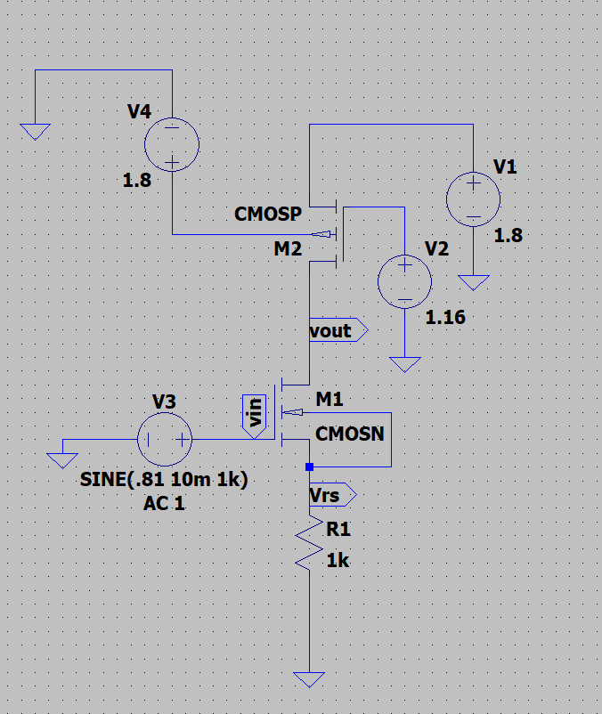
### 9. DC Analysis 

 DC BIAS CALCULATION – CIRCUIT A  
(Common Source with Source Degeneration)

Given:

VDD = 1.8 V  
ID = 200 µA  
Vov = 0.25 V  
VTH (NMOS) = 0.36 V  
|VTH (PMOS)| = 0.39 V  

------------------------------------------------------------

### Step 1: Choose Drain-Source Voltage for Symmetric Swing

For maximum output swing:

VDS = VDD / 2  

VDS = 1.8 / 2  

VDS = 0.9 V  

------------------------------------------------------------

### Step 2: Assume Source Voltage

Let:

VS = 0.2 V  

------------------------------------------------------------

### Step 3: Calculate Output Voltage

VDS = Vout − VS  

0.9 = Vout − 0.2  

Vout = 0.9 + 0.2  

Vout = 1.1 V  

------------------------------------------------------------

### Step 4: Calculate Source Resistor (RS)

VS = ID × RS  

RS = VS / ID  

RS = 0.2 / (200 × 10⁻⁶)  

RS = 1000 Ω  

RS = 1 kΩ  

------------------------------------------------------------

### Step 5: Calculate VGS (NMOS)

VGS = VTH + Vov  

VGS = 0.36 + 0.25  

VGS = 0.61 V  

------------------------------------------------------------

### Step 6: Calculate Gate Voltage (VG)

VGS = VG − VS  

VG = VGS + VS  

VG = 0.61 + 0.2  

VG = 0.81 V  

------------------------------------------------------------

### Step 7: PMOS Bias Calculation

For PMOS:

VSG = Vov + |VTHp|  

VSG = 0.25 + 0.39  

VSG = 0.64 V  

PMOS Source = VDD = 1.8 V  

VSG = VS − VGp  

1.8 − VGp = 0.64  

VGp = 1.8 − 0.64  

VGp = 1.16 V  

------------------------------------------------------------

### Step 8: Saturation Condition Check

NMOS:

VDS = 0.9 V  
VOV = 0.25 V  

Since 0.9 > 0.25  
NMOS operates in saturation.

PMOS:

VSD = 1.8 − 1.1  
VSD = 0.7 V  

Since 0.7 > 0.25  
PMOS operates in saturation.

------------------------------------------------------------

### Final DC Operating Point(from theretical calculations)

VS   = 0.2 V  
VDS  = 0.9 V  
Vout = 1.1 V  
VG   = 0.81 V  
VGp  = 1.16 V  
ID   = 200 µA  
RS   = 1 kΩ  

------------------------------------------------------------
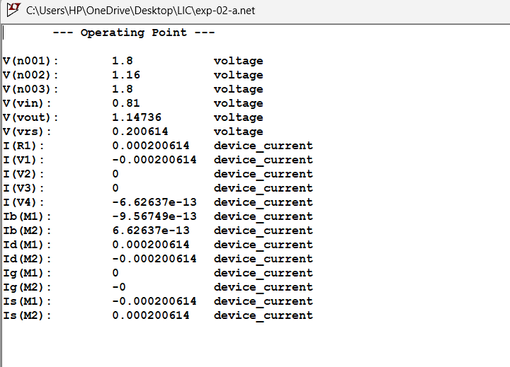
###  Width Selection for Circuit 2A

The MOSFET widths were calculated earlier using the 
square-law saturation equation to obtain ID = 200 µA.

The calculated values are:

NMOS  : W = 15.16 µm  
PMOS  : W = 35.9 µm  

(Refer Section 8: Width Calculation_FROM DEVICE PARAMETERS)

### Practical Width Adjustment

During LTspice simulation, the drain current obtained 
using theoretical widths was slightly different 
from the target value of 200 µA.

This deviation occurs due to:

• Channel length modulation  
• Mobility degradation  
• Velocity saturation  
• Short-channel effects  

Hence, widths were slightly adjusted in LTspice 
until ID ≈ 200 µA was achieved.

Final Dimensions Used in Simulation:

NMOS  : W = 29u µm  
PMOS  : W = 83u µm  

------------------------------------------------------------

##  Transient Analysis – Circuit 2A  
(Source Degenerated Common Source Amplifier)

To verify time-domain performance of the amplifier,
a small-signal sinusoidal input was applied.

### Input Signal Parameters

• Type        : Sine wave  
• Frequency   : 1 kHz  
• Amplitude   : 10 mV  
• DC Offset   : 0.81 V  

Input Command Used in LTspice:

Vin = SINE(0.81 10m 1k)

------------------------------------------------------------

The DC offset (0.81 V) corresponds to the calculated
gate bias voltage required to maintain ID = 200 µA.

The 10 mV amplitude ensures small-signal operation,
keeping the transistor in saturation region.

------------------------------------------------------------

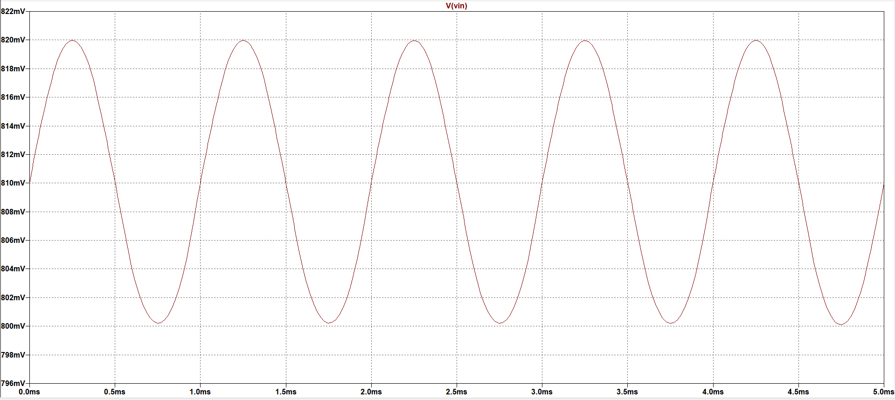

: Input Waveform Applied at Gate

------------------------------------------------------------

The output waveform is observed at the drain terminal.

Since this is a Common Source amplifier:

• Output is inverted (180° phase shift)  
• Output amplitude is greater than input amplitude  
• Signal is amplified around DC bias point (≈ 1.1 V)

------------------------------------------------------------

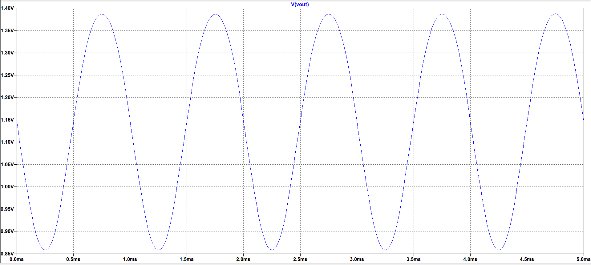

: Output Waveform at Drain

------------------------------------------------------------

Both input and output waveforms plotted together:

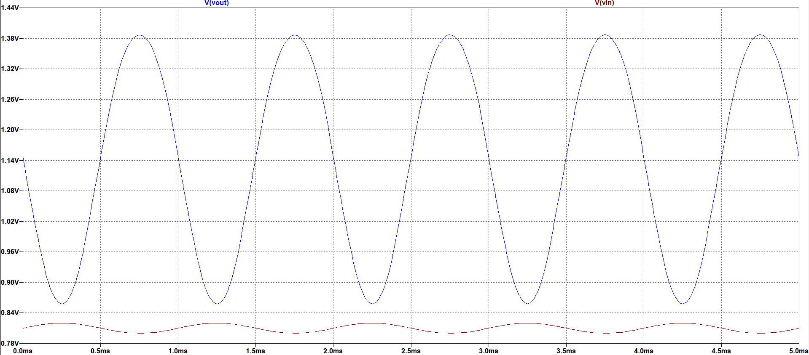

: Input vs Output Waveforms

------------------------------------------------------------

### Observations

• Output signal is inverted relative to input.  
• Amplification is clearly observed.  
• Output swing remains within saturation limits.  
• No clipping is observed for 10 mV input amplitude.  
• DC bias point remains stable at approximately 1.1 V.

------------------------------------------------------------
Measured:

Vin(p-p) = 0.819V - 0.800V
Vin(p-p) =0.019V

Vout(p-p) = 1.386V − 0.858V 
Vout(p-p) = 0.528V 

Practical gain:

Av = Vout / Vin  

Av = 0.528 / 0.019  

Av = 27.78 V/V 

Gain in dB:

Av(dB) = 20 log(27.78)  

Av(dB) = 28.87 dB  

This is the gain obtained from transient waveform.

---
# AC Analysis
## – Frequency Response (Circuit 2A)

To determine midband gain and bandwidth,
small-signal AC analysis was performed.

AC Simulation Command Used:

.ac dec 1000 .1 1G

Input AC magnitude = 1 V

------------------------------------------------------------

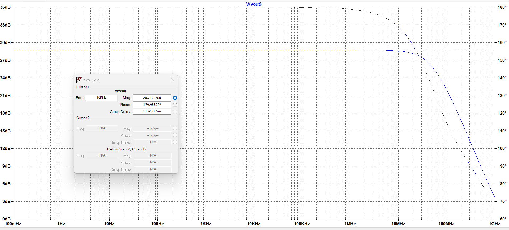

Figure: AC Gain (Magnitude vs Frequency)

From AC plot:

maximum Gain ≈ 28.71 dB  

The measured AC gain is 28.71 dB, which strongly correlates with our transient calculation

-3dB point 25.71dB=52.119MHz

---------

To verify simulation, theoretical gain is calculated using small-signal values from LTspice.

gm1 = 1.6 mA/V      ro1 ≈ 58.8 kΩ  
ro2 ≈ 58.8 kΩ      RS = 1 kΩ  

Gain formula:

Av = - gm1 / (1 + gm1RS + RS/ro1) × ([gm1RSro1 + RS + ro1] || ro2)

Substitution:

Denominator = 1 + 1.6 + (1k/58.8k) = 2.617  

Bracket term = (1.6×58.8k + 1k + 58.8k) || 58.8k  
             ≈ 42.6 kΩ  

Av = - (1.6mS / 2.617) × 42.6k  
Av ≈ -26 V/V  

Gain ≈ 28 dB  

Theoretical gain matches AC and transient results.

### Reason for Difference Between Theoretical and Simulation Gain

The small difference between theoretical and simulated gain 
occurs due to non-ideal device effects present in the MOS model.

In hand calculations, simplified small-signal equations are used,
whereas LTspice uses the complete BSIM model which includes:

• Channel length modulation  
• Mobility degradation  
• Parasitic capacitances  
• Higher-order effects  

Hence, a slight variation (≈ 0.5–1 dB) between theoretical 
and simulation results is expected.
-----------------------------------------------------------------------------------
### EXP2- CIRCUIT 2B – Common Source – Cascode Amplifier with Active Load
-----------------------------------------------------------------------------------
### Circuit Implementation in LTspice

## DC Analysis – Circuit 2B (Cascode)

Given:

ID = 200 µA     Vov = 0.25 V  
VTHn = 0.36 V   VTHp = -0.39 V  
VDD = 1.8 V  

------------------------------------------------------------

### M2 (Bottom NMOS)

VGS2 = Vth + Vov  
VGS2 = 0.36 + 0.25 = 0.61 V  

Gate = 0.616 V  

VS2 = 0 V  
VD2 = VS1 ≈ 0.61 V  

✔ M2 in saturation (VDS2 ≈ 0.61 > 0.25)

------------------------------------------------------------

### M1 (Upper NMOS – Cascode)

Gate (DC) = 0.916 V  

VS1 = 0.61 V  

VGS1 = 0.916 − 0.61  
VGS1 = 0.306 V  

Simulation adjusts bias so ID ≈ 200 µA.
Vout=0.9+0.3=1.2V
VDS1 = Vout − VS1  
VDS1 = 1.2 − 0.61  
VDS1 = 0.59 V  

✔ M1 in saturation (0.59 > 0.25)

------------------------------------------------------------

### PMOS Load (M3)

Gate = 1.16 V  
Source = 1.8 V  

VSG3 = 1.8 − 1.16  
VSG3 = 0.64 V  

VSD3 = 1.8 − 1.2  
VSD3 = 0.6 V  

✔ PMOS in saturation (0.6 > 0.25)

------------------------------------------------------------

Final DC Voltages:

VS2 = 0 V  
VS1 = 0.61 V  
Vout = 1.2 V  

All transistors operate in saturation.
-------
### Reason for Choosing Higher Source Voltage in Cascode

In a cascode amplifier, the lower NMOS acts like an active
source resistor. It raises the source voltage of the upper
NMOS so that both transistors remain in saturation.

For saturation condition:

VDS ≥ Vov

If VS1 = 0.2 V,

then VDS2 = 0.2 V < 0.25 V  

so the lower NMOS enters triode region (not acceptable).

If VS1 ≥ 0.3 V (greater than Vov),

then VDS2 ≥ 0.25 V  

so both NMOS devices remain in saturation.

Hence, 0.2 V does not work, while 0.3 V or higher ensures

proper cascode operation.

---------------

###  LTspice Operating Point

###  Width Selection for Circuit 2B

The MOSFET widths were calculated earlier using the 
square-law saturation equation to obtain ID = 200 µA.

The calculated values are:

NMOS  : W = 15.16 µm  
PMOS  : W = 35.9 µm  

(Refer Section 8: Width Calculation_FROM DEVICE PARAMETERS)

### Practical Width Adjustment

During LTspice simulation, the drain current obtained 
using theoretical widths was slightly different 
from the target value of 200 µA.

• Cascode bias sensitivity  
• Channel length modulation  
• Non-ideal device effects  

Final dimensions used in simulation ensure
all transistors operate in saturation.
Hence, widths were slightly adjusted in LTspice 
until ID ≈ 200 µA was achieved.

Final Dimensions Used in Simulation:

M1-NMOS  : W = 26.88u µm  (mid)

M2-NMOS  : W=29.09u µm  (bottom)

M3-PMOS  : W = 83.37u µm (top) 

-----------------------------------------
## Transient Analysis – Circuit 2B (Cascode)

Input Signal:

Vin = SINE(0.916 10m 1k)

.tran 0 5m

------------------------------------------------------------

📌 Input Waveform

------------------------------------------------------------

📌 Output Waveform

------------------------------------------------------------

📌 Input & Output (Combined)

------------------------------------------------------------

Observation:

• Output is inverted (180° phase shift).  
• Output amplitude is significantly higher than input.  
• No clipping observed.  
• All transistors remain in saturation.

Measured:

Vin(p-p) = 0.925V - 0.906V
Vin(p-p) =0.019V

Vout(p-p) = 1.225V − 1.183V 
Vout(p-p) = 0.042V 

Practical gain:

Av = Vout / Vin  

Av = 0.042 / 0.019 

Av = 2.210 V/V 

Gain in dB:

Av(dB) = 20 log(2.210)  

Av(dB) = 6.88 dB  

This is the gain obtained from transient waveform.

----

# AC Analysis

## – Frequency Response (Circuit 2B)

To determine midband gain and bandwidth,
small-signal AC analysis was performed.

AC Simulation Command Used:

.ac dec 1000 .1 1G

Input AC magnitude = 1 V

------------------------------------------------------------

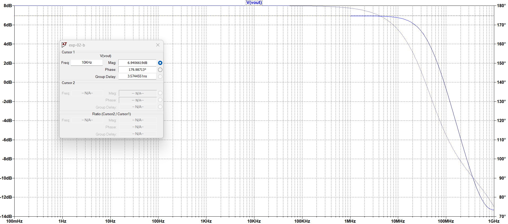

Figure: AC Gain (Magnitude vs Frequency)

From AC plot:

maximum Gain ≈ 6.94 dB

The measured AC gain is 6.94 dB, which strongly correlates with our transient calculation

-3dB point-->>3.94dB=45.289MHz

---------
## Theoretical Gain – Circuit 2B

gm1 = 1.6 mS  
ro1 ≈ ro2 ≈ ro3 ≈ 1.5 kΩ  

Gain formula:

Av =
- gm1 / (1 + gm1ro2 + ro2/ro1)
×
([gm1ro2ro1 + ro2 + ro1] || ro3)

------------------------------------------------------------

Substitution:

Denominator = 1 + 2.4 + 1 = 4.4  

Bracket term = 6.6k || 1.5k ≈ 1.2k  

Av = - (1.6mS / 4.4) × 1.2k  

Av ≈ -2.18 V/V  

Gain ≈ 6.9 dB 

Theoretical gain ≈ 6.88 dB,

which nearly matches AC and transient results (≈ 6.9 dB).

--------

### Reason for Small Difference Between Theory and Simulation

The slight difference between theoretical and simulated gain
occurs because theoretical calculations use simplified
small-signal equations, while LTspice uses a complete BSIM
model.

Simulation includes:

• Channel length modulation  
• Parasitic capacitances  
• Mobility degradation  
• Higher-order device effects  

Hence, a small variation (few tenths of dB) is expected.

---------------------------------------------------------

### EXP2- CIRCUIT C – Common Source Amplifier with Diode-Connected NMOS Current Source and PMOS Active Load
-------------------------------------------------------------

### Circuit Implementation in LTspice

## DC Analysis – Circuit 2C
## Bias Calculation – Circuit 2C  
(Common Source with Diode-Connected Current Source)

Given:

VTHn = 0.36 V 
VTHp =-0.39V
Vov = 0.25 V  
VDD = 1.8 V  

------------------------------------------------------------

### Step 1: Diode-Connected NMOS (M3)

Since M3 is diode-connected:

VD3 = VG3  

For ID = 200 µA,

VGS3 = Vthn + Vov  
VGS3 = 0.36 + 0.25  
VGS3 = 0.61 V  

Source of M3 = 0 V  

Therefore,

VD3 = VS1 = 0.61 V  

This fixes the source voltage of M1.

------------------------------------------------------------

### Step 2: Gate Voltage of M1

For M1 to carry same current:

VGS1 = Vthn + Vov  
VGS1 = 0.36 + 0.25  
VGS1 = 0.61 V  

Since,

VG1 = VS1 + VGS1  

VG1 = 0.61 + 0.61  

VG1 = 1.22 V  

Hence input DC bias = 1.22 V.

------------------------------------------------------------

### 3) PMOS Gate Voltage

For PMOS carrying same ID:

VSG2 = |Vthp| + Vov  
VSG2 = 0.39 + 0.25  
VSG2 = 0.64 V  

Since source of PMOS = VDD = 1.8 V,

VG2 = VS − VSG2  
VG2 = 1.8 − 0.64  
VG2 = 1.16 V  

✔ PMOS gate bias = 1.16 V  

------------------------------------------------------------

### 3) Output Voltage

VDS1 = 0.9 V   (vDD/2)

Vout = VDS1 + VS1  

Vout = 0.9 + 0.6  

Vout = 1.5 V  

All transistors operate in saturation.

------------------------------------------------------------

### Why 0.2 V or 0.3 V Will Not Work?

If VS1 = 0.2 V:

VGS3 = 0.2 V < Vthn (0.36 V)

M3 turns OFF → current will not flow.

Hence source voltage is not assumed.
It is fixed by the diode-connected NMOS bias condition.
--------------------------------------------------------------
###  LTspice Operating Point
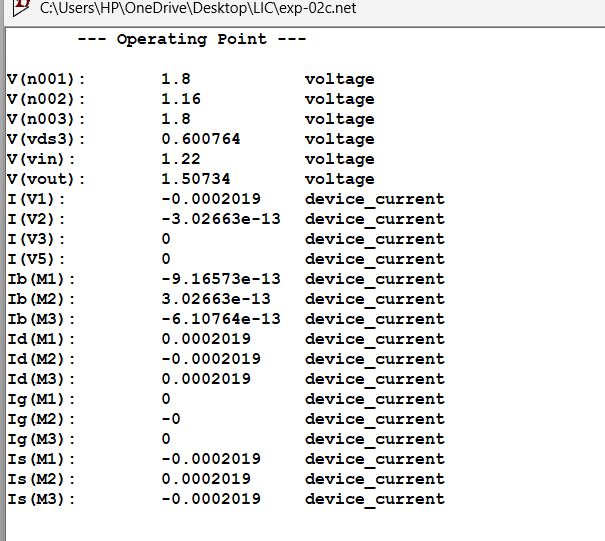
###  Width Selection for Circuit A

The MOSFET widths were calculated earlier using the 
square-law saturation equation to obtain ID = 200 µA.

The calculated values are:

NMOS  : W = 15.16 µm  
PMOS  : W = 35.9 µm  

(Refer Section 8: Width Calculation_FROM DEVICE PARAMETERS)

### Practical Width Adjustment

During LTspice simulation, the drain current obtained 
using theoretical widths was slightly different 
from the target value of 200 µA.

• Cascode bias sensitivity  
• Channel length modulation  
• Non-ideal device effects  

Final dimensions used in simulation ensure
all transistors operate in saturation.
Hence, widths were slightly adjusted in LTspice 
until ID ≈ 200 µA was achieved.

Final Dimensions Used in Simulation:

M1-NMOS  : W = 26.34u µm  (mid)

M2-PMOS  : W=87.87u µm  (top)

M3-NMOS  : W = 33.26u µm (top)

-----------------------------------------------
## Transient Analysis – Circuit 2C

Input Signal:

Vin = SINE(1.22 10m 1k)

.tran 0 5m

------------------------------------------------------------

📌 Input Waveform

------------------------------------------------------------

📌 Output Waveform

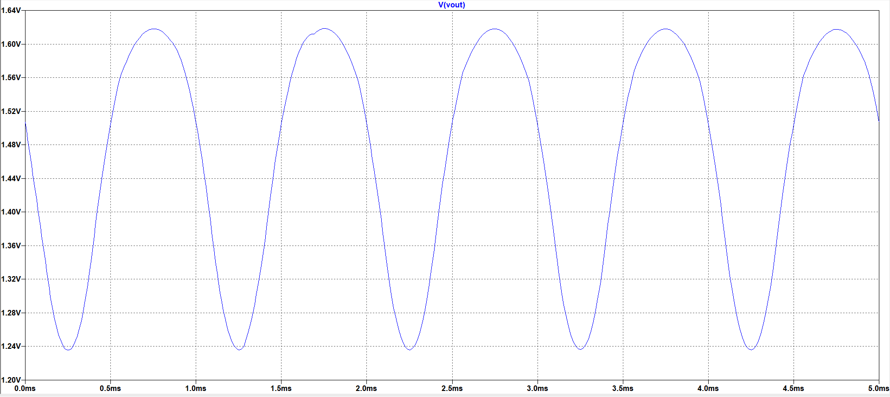

------------------------------------------------------------

📌 Input & Output (Combined)

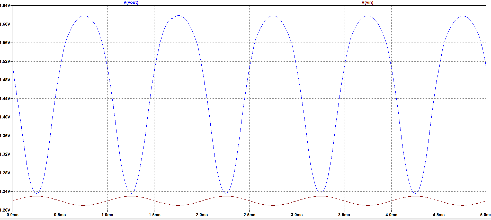

------------------------------------------------------------
Observation:

• Output is inverted (180° phase shift).  
• Output amplitude is greater than input.  
• No clipping observed.  
• Bias point remains stable around 1.5 V.

Measured:

Vin(p-p) = 1.229V - 1.210V
Vin(p-p) =0.019V

Vout(p-p) = 1.618V − 1.235V 
Vout(p-p) = 0.383V 

Practical gain:

Av = Vout / Vin  

Av = 0.383 / 0.019 

Av = 20.157 V/V 

Gain in dB:

Av(dB) = 20 log(20.157)  

Av(dB) = 26.08 dB  

This is the gain obtained from transient waveform.
----
# AC Analysis

## – Frequency Response (Circuit 2C)

To determine midband gain and bandwidth,
small-signal AC analysis was performed.

AC Simulation Command Used:

.ac dec 1000 .1 1G

Input AC magnitude = 1 V

------------------------------------------------------------

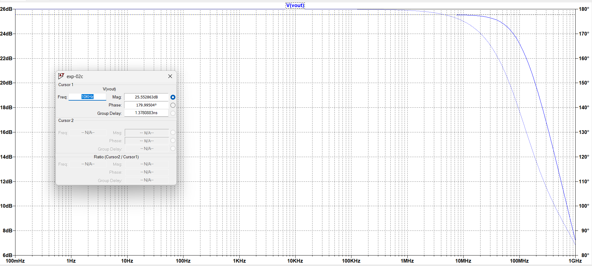

Figure: AC Gain (Magnitude vs Frequency)

From AC plot:

maximum Gain ≈ 25.55 dB 

The measured AC gain is 25.55 dB, which strongly correlates with our transient calculation

-3dB point-->>22.55dB=118.304MHz
------------------------------------------
## Theoretical Gain – Circuit 2C

Gain formula:

Av =
- gm1 / (1 + gm1ro3)
× (ro1 || ro2)

------------------------------------------------------------

gm1 = 1.6 mS  
ro1 ≈ ro2 ≈ ro3 ≈ 25 kΩ  

ro1 || ro2 = 12.5 kΩ  

Denominator = 1 + (1.6mS × 25k)  
            = 41  

Av = - (1.6mS / 41) × 12.5k  

Av ≈ -19.5 V/V  

Gain≈25.8dB

----------------------
### Reason for Difference Between Theoretical and Simulation Gain

The slight difference between theoretical and simulated gain
occurs because theoretical calculations use simplified
small-signal equations, while LTspice uses a complete MOSFET
model (BSIM).

Simulation includes:

• Channel length modulation variations  
• Parasitic capacitances  
• Mobility degradation  
• Body effect  
• Exact gm and ro values from operating point  

Hence, a small variation (≈ 0.5–1 dB) is expected.

----------

# Summary, Inference and Conclusion

## Summary

In this experiment, three MOSFET amplifier configurations were
implemented and analyzed:

• Circuit 2A – SOURCE DEGENERATED COMMON SOURCE AMPLIFIER
  • Circuit 2B – Common Source – Cascode Amplifier with Active Load 
• Circuit 2C –  Common Source Amplifier with Diode-Connected NMOS Current Source and PMOS Active Load
For each circuit:

- DC bias conditions were calculated.
- Saturation of all transistors was verified.
- Transient and AC analyses were performed.
- Theoretical gain was derived and compared with simulation.

------------------------------------------------------------

## Inference

• Source degeneration (2A) reduces gain but improves stability.  
• Cascode structure (2B) increases output resistance but practical loading reduced gain.  
• Active load configuration (2C) provides higher gain without source degeneration.  
• Theoretical and simulated gains closely match with minor variation due to non-ideal effects.

------------------------------------------------------------

## Comparison of All Three Circuits

| Parameter | Circuit 2A | Circuit 2B | Circuit 2C |
|------------|------------|------------|------------|
| Configuration | Source Degenerated CS | Cascode Amplifier | CS with Active Load |
| Source Node | Fixed by RS | Raised by Cascode NMOS | Fixed by Diode NMOS |
| Output Voltage (DC) | ≈ 1.1 V | ≈ 1.2 V | ≈ 1.5 V |
| Theoretical Gain | ≈ 28 dB | ≈ 6.9 dB | ≈ 25–26 dB |
| AC Gain | ≈ 28.6 dB | ≈ 6.9 dB | ≈ 25–26 dB |
| Gain Nature | Moderate | Low (practically limited) | High |
| Stability | High | High | Moderate |
| Complexity | Medium | High | Medium |

------------------------------------------------------------

## Conclusion

From the comparative study:

• Circuit 2A provides moderate gain with improved stability due to source degeneration.  
• Circuit 2B increases output resistance theoretically, but practical loading limited gain.  
• Circuit 2C provides high gain using active load without degeneration.  

Thus, different MOS configurations affect gain, output resistance,
and bias stability significantly. The experimental results
closely match theoretical calculations.

